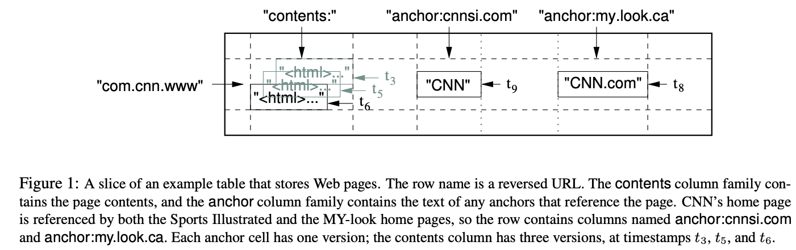

## 제프 딘 가라사대, “분산데이터저장소 있으라” 하시매..
[Bigtable](https://static.googleusercontent.com/media/research.google.com/ko//archive/bigtable-osdi06.pdf) 은 2006년에 구글에서 공개한 분산 데이터 저장소이다. 아마 구글이 처음으로 공개한 분산 데이터 저장소일 것이다. Bigtable 은 구글의 여러 서비스에서 사용되고 있으며, 그 중에서도 구글 검색 엔진과 구글 맵스에서 사용되고 있다.
[현재는 구글 클라우드를 통해 서비스 되고 있는 것을 확인할 수 있다.](https://cloud.google.com/bigtable?hl=ko)

Bigtable 공개로 부터 15년이 훌쩍 넘은 지금은 분산 시스템을 다루는 모던한 기술들이 많이 있지만, 2006년 당시에는 대단한 기술이었고, 현재의 구글의 핵심 서비스들의 기반이 되는 기술이다.

__그럼 이 Bigtable 은 누가 만들었을까?__

<!-- truncate -->

<p style={{ textAlign: 'center' }}>
  
  <em>출처: <a href="https://ttimes.co.kr/article/2023050418237753322/">ttimes</a></em>
</p>


chatgpt 는 물론 stack overflow, 구글링 같은 웹에서 양질의 정보를 찾기 힘든 시절에 이러한 시스템을 만든 사람은, 아직까지도 구글에서 단 2명 뿐인 L11 개발자인 **제프 딘(Jeff Dean)** 이다.
언제나 그렇듯이 구글에서 만든 Fancy 한 기술들의 저자들의 이름에서 Jeff Dean 을 쉽게 찾아 볼 수 있다.

([하지만 제프딘 형님은 인터뷰에서 엔지니어로 살아오면서 저질렀던 가장 큰 실수라고 한다..](https://dev-ahn.tistory.com/136))
## 근데 왜 15년이나된 고대 기술을  알아야하는가?
[Pirius](https://github.com/paust-team/pirius) 프로젝트를 진행하면서 분산 환경에서의 storage를 구현하는데 핵심이 되는 RocksDB 를 이해하기 전에, LevelDB 와 Bigtable 에 대해 이해가 필요하다고 판단을 했다.

우선 Bigtable은 분산 NoSQL 데이터베이스로(당시엔 NoSQL 이라는 용어가 익숙하지 않았지만..), 내부적으로 **LSM(Log-Structured Merge) 트리 기반의 SSTable 구조** 를 사용한다.
BigTable 논문이 공개된 뒤, 같은 아이디어를 바탕으로 단일 노드용 LSM 엔진인 LevelDB 가 공개되었고, 이후에 페이스북이 **LevelDB** 를 Fork 하여 Performance, Concurrency, Configuration 등을 확장한 버전인 **RocksDB** 를 만들었다.

Bigtable 기술 자체는 15년전에 나온 아이디어지만, 내부에서 Bigtable을 기반으로 다양한 서비스가 운영되면서 계속 개량과 확장을 거쳤고, 그 기술을 클라우드 서비스 형태로 재구성해 외부에 제공한 것이 Google Cloud Bigtable 이다.
따라서 내가 분석할 Bigtable 은 2006년 당시의 논문이므로, 현재 GoogleCloud 의 Bigtable 구조와 기능적인 부분에서 차이가 있을 수 있다.
그래도 LevelDB, RocksDB 의 기반이 되는 SSTable 의 기반 구조는 아직까지 남아있으며, 분산 시스템에서의 여러 mission critical 한 부분들을 어떻게 해결했는지에 대한 인사이트를 얻을 수 있을 것이라 생각한다.

## "A Distributed Storage System for Structured Data"
Bigtable 은 논문의 제목 그대로 **Structured Data** 를 위한 분산 저장소이다. 그럼 Structured Data 란 무엇인가?
- **Structured Data**:
  - 정형화된 데이터로, 관계형 데이터라 불리며 Strict Schema 를 준수하는 데이터
  - 예를 들어, 테이블 형태로 저장된 데이터, 즉 행(row)과 열(column)로 구성된 데이터
- **Unstructured Data**:
  - 비정형화된 데이터로, 관계형 데이터베이스에서 사용되지 않는 데이터 모델을 따르는 데이터
  - 예를 들어, 이미지, 비디오, 오디오, 텍스트 파일 등
- **Semi-Structured Data**:
  - 반정형화된 데이터로, 관계형 데이터베이스에서 사용되지만, 정형화된 데이터 모델을 따르지 않는 데이터
  - 예를 들어, XML, JSON, YAML 등

아래 차차 분석해보겠지만, Bigtable 에서는 **Row/Column/Column Family/Timestamp** 라는 정해진 형태(structured)로 데이터를 저장한다.

논문의 abstract 에 나와있는 내용을 보면, Bigtable 은 다음과 같은 목적을 가지고 있다.

1. **대규모 데이터 관리를 위한 분산 스토리지 제공**
- 페타바이트(PB)급 데이터와 수천 대 규모의 저비용 서버(commodity servers)를 활용해 매우 큰 스케일로 데이터를 저장하고 처리할 수 있도록 설계되어야함
2. **다양한 구글 서비스에서의 공통 스토리지 요구 사항 충족**
- 구글 검색 색인(web indexing), 구글 어스, 구글 파이낸스 등 서로 다른 요구 사항을 가진 애플리케이션들이 Bigtable을 사용해야함
- 데이터의 종류(예: URL, 웹페이지, 위성 이미지 등)와 처리 지연(latency) 요구가 서로 다른 상황에서, 유연하고 고성능인 스토리지로 기능해야함
3. **단순한 데이터 모델과 동적 제어**
- 클라이언트가 데이터 구조와 포맷을 동적으로 제어할 수 있도록 함으로써 다양한 사용 시나리오를 지원해야함
4. **유연성과 고성능을 동시에 제공**
- 여러 Google 제품들이 요구하는 높은 처리량과 빠른 응답 속도를 모두 만족해야함

위와 같은 요구사항들을 충족하기 위해 Bigtable 에선 어떤 해법을 제시했는지 살펴보자.

## Bigtable 의 데이터 모델
> A Bigtable is a sparse, distributed, persistent multidimensional **sorted map**. The map is **indexed by a row key, column key, and a timestamp**; each value in the map is an **uninterpreted array of bytes**. (row:string, column:string, time:int64) → string

Bigtable 의 구현부를 살펴보기전에 Data model 부터 살펴볼 필요가 있다. 위에서 기술한 것 처럼 Bigtable 은 **multi-dimensional sorted map** 이다.
여기서 multi-dimensional sorted map 이라 함은,
1. Row key, Column key, Timestamp 라는 **세 차원(multi-dimensional)** 으로 구성된,
2. Row key를 기준으로 전체 데이터가 사전순(lexicographical) **정렬(sorted)** 된,
3. **key-value 쌍(map)** 이라는 의미이다.

이러한 설계 이점은 Row key 를 기준으로 정렬되어 있기 때문에, 특정 **Row key 를 기준으로 데이터를 빠르게 검색**할 수 있고, **Range Scan** 을 가능하게 한다는 것이다. 이로써 **Data 의 Locality** 를 보장할 수 있다.

논문에서 figure1 으로 설명하고 있는 Webtable 예제를 보면, Bigtable 의 데이터 모델을 이해하는데 도움이 된다.


이를 RDB 의 테이블 관점으로 생각하면 잘 이해가 가지 않는 구조다. Bigtable 이 NoSQL 과 가까운 것을 생각해보면, JSON 구조로 nested 데이터 구조로 표현해 볼 수 있다. (실제로는 json 형태로 저장하지 않지만..)
```json
{
  "com.cnn.www": {
    "anchor": {
      "cnnsi.com": {
        "t9": "CNN"
      },
      "my.look.ca": {
        "t8": "CNN.com"
      }
    },
    "contents": {
      "t3": "<html>...</html>",
      "t5": "<html>...</html>",
      "t6": "<html>...</html>"
    }
  }
}
```
Bigtable 에 저장되는 데이터는 3차원 array 에 접근하는 expression 으로 예를 들자면, `array[rowkey][columnkey][timestamp]` 형태로 접근할 수 있을 것이다.
**column key** 는 **column family 와 qualifier** 를 조합하여 만들어지며(위에서 column family 는 `anchor`, `contents`), **value 는 timestamp 별로 관리**가 되는 형태라 볼 수 있다.  이렇게 timestamp 는 **row 의 각 column 에 대해 버전 관리**가 가능하다.

음.. 여기서 의문이 생길 만한 질문을 몇개 던져보자.
- **Row Key 는 어떻게 정해지는가?**
  - 👉 Row Key 는 사용자가 정해줄 수 있다. 예를 들어, URL 을 Row Key 로 사용하면, URL 을 기준으로 정렬된 데이터를 저장할 수 있다.
- **예제에선 왜 Row Key 를 URL 역순으로 저장했는가?**
  - 👉 Row Key 를 역순으로 저장하면, URL 의 접두사(prefix) 검색이 가능하다. 예를 들어, com.cnn 으로 subdomain 을 제외하고 검색할 때, wildcard 검색을 통해 com.cnn 으로 시작하는 모든 URL 을 iterate 할 수 있다. (Locality of data 의 장점으로)
- **같은 Row Key, Column Family 에 Timestamp 별 버전을 관리한다는 것은, row 를 update 하지 않고 insert 하는 방식인가?**
  - 👉 맞다. Bigtable 은 row 를 update 하지 않고 insert 하는 방식이다. 즉, row 를 update 하는 것은 in-place update 로 덮어쓰는 것이 아니라, 새로운 row 를 insert 하는 것이다. 이로 인해, row 의 버전 관리가 가능하다.
  이는 LSM 트리 구조로 부터 생기는 특징으로 뒤에서 자세히 설명할 예정이다.
- **Qualifier 는 필수가 아닌가?**
  - 👉 맞다. Qualifier 는 필수가 아니다. 즉, Column Family 만으로도 데이터를 저장할 수 있다. 예를 들어, `anchor` 라는 Column Family 만으로도 데이터를 저장할 수 있다. 하지만, Qualifier 를 사용하면 더 세부적인 데이터 구조를 만들 수 있다.

추가적으로 Qualifier 는 무엇인지, Column 이면 column 이지 Column Family 는 무엇인지 등 궁금증이 생긴다. 위의 예제만을 보고는 아직 Data model 에 대해서 잘 와닿지 않을 수 있다. 그래서 Bigtable 의 Data model 를 구성하는 요소들에 대해 좀 더 자세히 살펴보자.

### Rows
- **Row Key 의 특성**
  - 임의의 문자열을 Row Key로 사용 가능, 최대 64KB까지 지원 (일반적으로 10~100바이트 정도를 사용)
  - 동일 Row Key에 대한 읽기/쓰기는 **Atomic** 하게 처리됨(해당 Row에 있는 여러 컬럼에 대한 연산도 동시에 atomic operation 으로 수행).
- **Lexicographic 정렬 및 동적 분할**
  - Bigtable은 **Row Key 기준으로 사전순(lexicographic order) 정렬을 유지**함.
  - 테이블은 **Row Key의 범위에 따라 동적으로 분할(파티셔닝)**되고, 각 범위를 **Tablet**이라 부름.
  - **Tablet 단위로 분산 및 부하 분산**(load balancing)이 이뤄지므로,
    - 인접한 Row 범위를 읽을 때는 비교적 적은 수의 서버(node)만 통신하면 되어서 효율적. (Locality of data)
- **로컬리티(Locality) 를 고려한 RowKey 설계 가능**
  - 사용자는 **RowK ey를 잘 설계하여, 자주 함께 조회되는 데이터가 서로 인접하도록 저장할 수 있음**.
    - 예시: 웹 페이지를 저장하는 Webtable은 도메인을 뒤집어서(예: com.google.maps/index.html) Row Key로 사용
  - 이를 통해 동일 도메인(maps.google.com, mail.google.com 등)의 웹 페이지들이 인접한 범위를 이루게 됨.
  - 이러한 접근 방식은 호스트나 도메인 단위의 분석에 유리하고, **연관 데이터 스캔 시 효율이 높아짐**.

- **Row key 에 대한 atmoic operation 이 가지는 장점**
  - 여러 column 간의 부분 갱신으로 인한 데이터 불일치 문제를 방지 (일관성 유지)
  - Row 단위로 lock 이 걸리기 때문에 여러 column 간에 all-or-nothing 의 atomicity 를 보장
  - 쓰기 작업 실패로 인한 부분 column 갱신을 방지 (rollback 등 필요없음)

### Column Family
- **Column Family의 기본 개념 및 구성**
  - Column Family는 **여러 개의 열(Column)들을 하나의 그룹으로 묶은 것**으로, Bigtable 에서의 기본 접근 제어 단위
  - **데이터 일관성**: 한 Column Family 내에 저장되는 모든 데이터는 보통 같은 유형이며, **같은 유형의 데이터를 함께 압축**하여 저장할 수 있음
  - **생성 순서**: Column Family는 **미리 생성**되어 있어야 하며, 생성된 후 그 안에서 어떤 Column key(형식: family:qualifier)도 사용가능

- **Column Family 의 제약 조건**
  - 테이블 내의 **Column Family는 수백 개 정도로 제한**되어 있고(대략 수백 개 이하), **운영 중에는 잘 변하지 않는 것**이 이상적
  - 반면, 개별 **Column key(또는 Qualifier)는 무제한으로 생성**될 수 있음

- **Column Family vs. Columns**
  - RDB의 Column은 정해진 스키마에 따라 모든 행에 대해 동일하게 존재하는 **고정형 데이터 필드**로, 데이터 타입과 제약이 엄격하게 적용됨
  - 반면, Bigtable의 Column Family는 **미리 정의된 그룹 단위**로, **이 그룹 내에서 동적으로 다양한 Column Qualifier(실제 컬럼)가 추가**될 수 있으며, **이 단위로 압축, 접근 제어, 리소스 관리** 등이 이루어짐


### Timestamps
- **다중 버전 관리의 목적**
  - Bigtable의 각 셀은 동일 데이터의 여러 버전을 저장할 수 있으며, 이들 각각은 Timestamp에 의해 구분
  - Timestamp는 64비트 정수로 표현되며, 각 버전은 이 숫자를 기반으로 정렬(내림차순) 되므로 가장 최신의 데이터에 빠르게 접근이 가능

- **Timestamp의 할당**
  - **자동할당**: Bigtable이 자동으로 timestamp를 부여하는 경우, ms 단위로 실제 시간을 기록
  - **수동할당**: 사용자가 직접 timestamp를 지정하는 경우, 사용자가 원하는 값을 설정 가능 (중복 되지 않도록 해야함)

- **Garbage Collection 매커니즘**
  - **각 셀에 대해 최대 n 개의 버전만 유지**하도록 설정 가능
  - 또는, 유효 기간이 지난 데이터는 **자동으로 삭제**되도록 설정 가능 (ex. 마지막 7일 이내의 데이터만 유지 등)

여기까지, Bigtable 의 개요와 데이터 모델에 대해 정리해보았다. 다음 Part 에서는 Bigtable 을 이루는 Building Block 들과 주요 implementation 에 대해 살펴보겠다.
